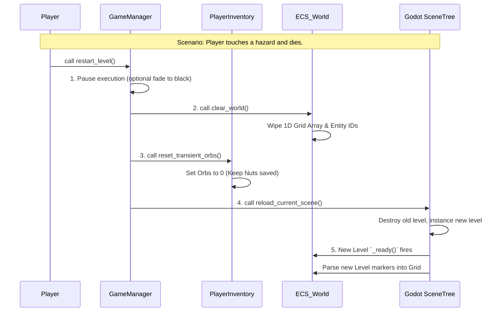

# Game State & Level Management
**Script:** `GameManager.gd` (Autoload / Singleton)
**Purpose:** Handles the lifecycle of the game, including level transitions, death resets, and orchestrating the tear-down of the ECS back-end before Godot loads a new front-end scene.

---

## 1. The Lifecycle Problem
When a player completes a level or dies, Godot can easily swap to a new `.tscn` file using `get_tree().change_scene_to_file()`. 

However, because we are using a **Hybrid Architecture**, Godot changing the visual scene does *not* automatically clear the arrays inside the `ECS_World` Autoload or reset the Orbs in the `PlayerInventory` Autoload. If we don't manually clear the Back-End, the new level will load, but the invisible grid will still think the previous level's Earth blocks are there.

## 2. The Transition Flow
To prevent data leaks, the `GameManager` must act as the conductor, forcing the Autoloads to clear their memory before asking Godot to load the next level.



``` txt
extends Node
# GameManager.gd - Set this as an Autoload in Project Settings

# --- Signals ---
signal level_started
signal level_transitioning

# --- Variables ---
var current_level_path: String = ""

# --- Core Methods ---

## Called by the Front-End when the Fairy touches the final Nut.
func load_next_level(next_level_path: String) -> void:
    print("GameManager: Transitioning to ", next_level_path)
    emit_signal("level_transitioning")
    
    _teardown_current_state()
    
    # Tell Godot to swap the visual scene
    var err = get_tree().change_scene_to_file(next_level_path)
    if err != OK:
        push_error("GameManager: Failed to load level at " + next_level_path)
    else:
        current_level_path = next_level_path
        # In a full game, wait for the scene to finish loading before emitting
        emit_signal("level_started")

## Called by the Front-End when the Fairy touches a hazard.
func restart_current_level() -> void:
    print("GameManager: Player died, restarting level.")
    emit_signal("level_transitioning")
    
    _teardown_current_state()
    
    var err = get_tree().reload_current_scene()
    if err != OK:
        push_error("GameManager: Failed to restart current scene.")
    else:
        emit_signal("level_started")

# --- Private Methods ---

## Cleans up the Back-End Autoloads before a scene change.
func _teardown_current_state() -> void:
    # 1. Halt the ECS logic so it doesn't process during the load
    ECS_World.set_physics_process(false)
    
    # 2. Wipe the grid and entities
    ECS_World.clear_all_data()
    
    # 3. Reset the player's elemental ammo (Orbs), but keep permanent progression (Nuts)
    PlayerInventory.reset_transient_inventory()
    
    # 4. Resume the ECS (It will sit idle until the new level's _ready() feeds it data)
    ECS_World.set_physics_process(true)
